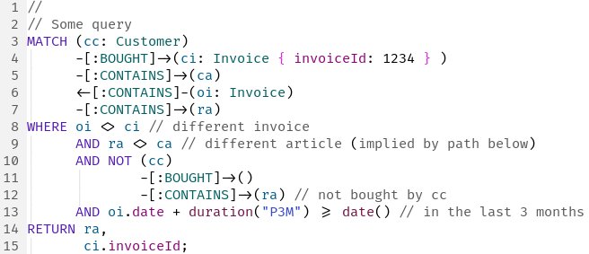
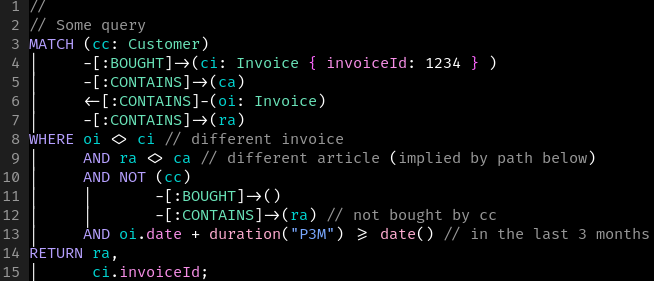

#+TITLE: Major Mode for Cypher files using Tree-Sitter
#+AUTHOR: Julian Flake <flake@uni-koblenz.de>
#+OPTIONS: toc:nil

[[http://melpa.org/#/cypher-ts-mode][http://melpa.org/packages/cypher-ts-mode-badge.svg]]
[[http://stable.melpa.org/#/cypher-ts-mode][http://stable.melpa.org/packages/cypher-ts-mode-badge.svg]]

* Features
- Function to install ~tree-sitter-cypher~ grammar library
- Syntax highlighting: font lock configuration, keywords defined according to [[https://github.com/opencypher/openCypher/blob/main/cip/0.baseline/openCypher9.pdf][Cypher Query Language Reference, Version 9]]
- Indentation: a few rules to indent query elements in a meaningful way

* Requirements
- ~treesit.el~ (part of Emacs 29+)
- ~tree-sitter-cypher~ grammar, [[https://github.com/taekwombo/tree-sitter-cypher][available here]].
You can install the grammar library with ~M-x cypher-ts-mode-install-grammar~

* Installation
There are different ways to install this package:
- This package is available at [[https://stable.melpa.org/#/cypher-ts-mode][MELPA]]
- You can clone this repository, e.g., at a specific release tag and add the directory to your loadpath
- This package is available as [[https://packages.guix.gnu.org/packages/emacs-cypher-ts-mode/0.2/][GNU Guix package]]

* Configuration
Using ~use-package~:
#+begin_src emacs-lisp
  (use-package cypher-ts-mode
    ;; if you cloned the repository:
    :load-path "~/git/cypher-ts-mode")
#+end_src

* Screenhots
** Modus Operandi

** Modus Vivendi

* Alernatives
- There is also a non-tree-sitter major mode for Cypher files: https://github.com/fxbois/cypher-mode
